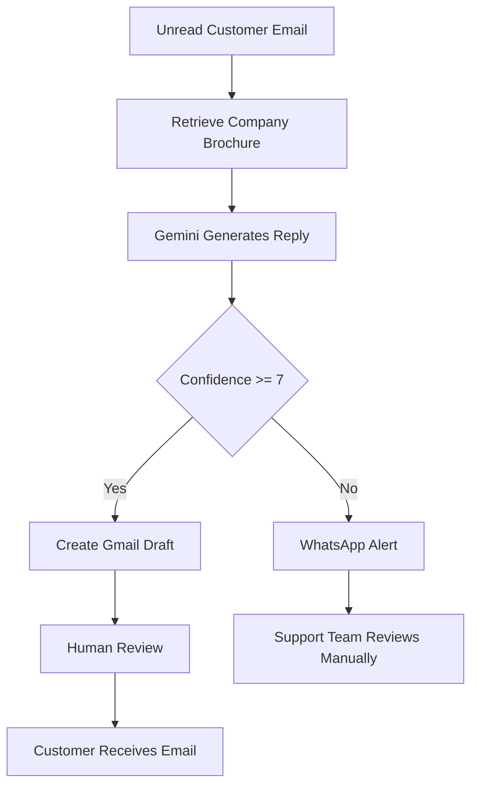

# ConfiDesk - AI Customer Support Agent
A safety-first customer support platform that uses AI agents to draft accurate email replies based only on a company's custom brochure, while keeping a human manager in control to approve drafts or step in via WhatsApp alerts if the AI gets confused.


## Features

- **Real‑time inbox fetching** – pulls unread emails directly from Gmail.
- **RAG‑powered reply generation** – uses Google Gemini + your company brochure to produce accurate drafts.
- **Confidence‑based routing** – high‑confidence replies become ***Gmail drafts** (human approval required); low‑confidence cases trigger a ***WhatsApp alert** to the support team.
- **Human review dashboard** – edit, approve, and send drafts or discard them – all from a Streamlit UI.
- **Persistent log** – all processed emails are saved locally, so history survives restarts.


## How It Works



  
## Team & Roles

|         Person         |                Role                |                     Responsibilities               |
|------------------------|------------------------------------|----------------------------------------------------|
|  **Palak Saraswat**    | Orchestrator & LangGraph Architect | Workflow graph (`graph_builder`, `state`, `nodes`) |
|  **Soha**              | AI/ML Engineer                     | Gemini RAG agent, retriever, knowledge base        |
|  **Shruti**            | Backend Developer – Email          | Gmail API (draft, send, inbox fetch)               |
|  **Viyanshi Chaudhary**| Backend Developer – Notifications  | WhatsApp escalation via Make.com                   |
|  **Anushka Shrotriya** | UI/UX Developer                    | Streamlit dashboard                                |


## Quick Start (Local)

```
1)Clone the repository and switch to dev branch
bash
git clone <repo-url>
cd ConfiDesk
git checkout dev

2)Install dependencies
bash
pip install -r requirements.txt

3)Prepare environment variables
a. Copy the file .env.example to a new file named .env.
(Right‑click → Copy/Paste, or use your file manager)
b. Open .env and fill in your own values:
c. GOOGLE_API_KEY – your Gemini API key from Google AI Studio.
d. MAKE_WEBHOOK_URL – the webhook URL from Make.com (for WhatsApp alerts).

4)Gmail OAuth Setup
a. Obtain a credentials.json file from the Google Cloud Console (Desktop app, Gmail API scopes: compose, send, modify).
b. Place the file in the project root (same folder as app.py).
Important: Never commit credentials.json or the generated token.json – they are already in .gitignore.

5)Launch the app
bash
streamlit run app.py
The first run will open a browser window for Google login. After authorisation, a token.json file is created automatically, and the dashboard displays unread emails from the authenticated Gmail account.

```
---

## Built with ❤️ by Team ConfiDesk

**Palak Saraswat**   • **Soha**   • **Shruti**   • **Viyanshi Chaudhary**   • **Anushka Shrotriya**

---
